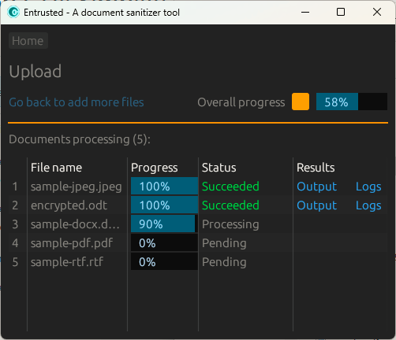

#+TITLE: Entrusted document sanitizer tool

This application is being rewritten (usability, coding practices, maintainability).

* Changes
- UI
  - The UI toolkit was changed from [[https://github.com/fltk-rs/fltk-rs][fltk-rs]] to [[https://github.com/emilk/egui][egui]]
  - Logic was simplified
- Processing
  - PDF manipulation now leverages [[https://mupdf.com/][MuPDF]] instead of [[https://poppler.freedesktop.org/][Poppler]] (and related libraries)
  - Most of the transformations are done in-memory instead of creating several intermediate files
- General refactoring and libraries updates

* Problems to solve

- User friendly sandbox approach ([[https://learn.microsoft.com/en-us/windows/msix/overview][MSIX]] with =appcontainer= on Windows, [[https://flatpak.org/][Flatpak]] on Linux, [[https://developer.apple.com/documentation/bundleresources/entitlements][Entitlements]] on macOS)
- Unflexible Office document conversion on macOS ([[https://bugs.documentfoundation.org/show_bug.cgi?id=145127][Lack of LibreOffice headless support]])
  - One option is to attempt to use [[https://api.onlyoffice.com/docs/docs-api/additional-api/document-builder-api/][OnlyOffice]] instead of [[https://docs.libreoffice.org/libreofficekit.html][LibreOffice]] on all platforms (much more lightweight)
  - Another approach is to either embed [[https://podman.io/][Podman]] on macOS or bundle a Linux image ([[https://developer.apple.com/documentation/virtualization][Virtualization framework]])
  - A radical solution is to just drop macOS support

* Screenshots

* Downloads
There are no releases yet, as there are current unresolved issues and pending decisions.

* References
- UI
  - https://github.com/emilk/egui
  - https://github.com/microsoft/mimalloc
- Processing  
  - https://github.com/jacobtread/libreofficekit
  - https://github.com/messense/mupdf-rs
- App isolation
  - Linux
    - https://docs.flatpak.org/en/latest/
    - https://man7.org/linux/man-pages/man2/seccomp.2.html
    - https://landlock.io/
    - https://apparmor.net/
    - https://fedoraproject.org/wiki/SELinux
  - Windows
    - https://learn.microsoft.com/en-us/windows/win32/secauthz/appcontainer-isolation
    - https://learn.microsoft.com/en-us/windows/msix/overview
    - https://learn.microsoft.com/en-us/windows/security/application-security/application-isolation/windows-sandbox/
  - macOS
    - https://developer.apple.com/documentation/bundleresources/entitlements
    - https://developer.apple.com/documentation/security/app-sandbox
